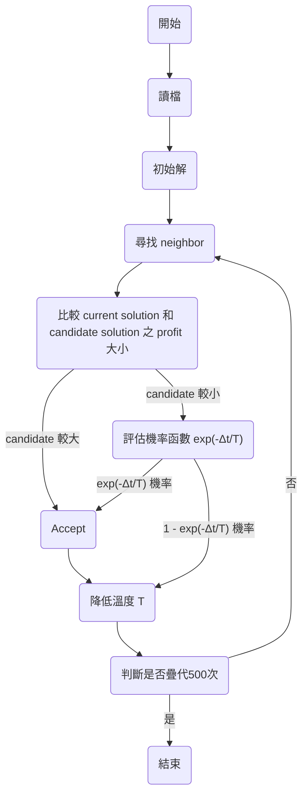

## 目錄
- [虛擬碼](#虛擬碼)
- [程式流程](#程式流程)
- [函式介紹](#函式介紹)
  - [讀檔](#讀檔)
  - [初始解](#初始解)
  - [計算價值](#計算價值)
  - [尋找鄰近點](#尋找鄰近點)
  - [計算重量](#計算重量)
- [初始變數設定](#初始變數設定)
- [畫圖](#畫圖)
- [成果](#成果)
- [參考資料](#參考資料)

## 虛擬碼
```c
create a random initial permutation
loop 500 times
  create an adjacent candidate solution
  if candidate is better than curr solution then
    curr solution = candidate (accept)
  else if candidate is worse then
    accept candidate anyway with small prob
  end-if
  
  decrease prob of accepting worse candidate
end-loop
return best solution found
```

## 程式流程

https://github.com/Kenhchs/AWINLAB/blob/fc36d855c90cf6f877089265eaa5c5396a3be82a/2.Meta-heuristic%20Algorithm/2.Simulated%20annealing/simulated_annealing.py#L74-L86

## 函式介紹
### 讀檔
讀取儲存```背包容量```、```物品重量```、```物品價值```的檔案，並且分別存入變數```capcity```、```weights```、```profits```
https://github.com/Kenhchs/AWINLAB/blob/fc36d855c90cf6f877089265eaa5c5396a3be82a/2.Meta-heuristic%20Algorithm/2.Simulated%20annealing/simulated_annealing.py#L5-L18

### 初始解
在物品重量不超過背包容量的情況下，從```0```到```物品長度-1```物品，隨機挑選物品放入背包
https://github.com/Kenhchs/AWINLAB/blob/fc36d855c90cf6f877089265eaa5c5396a3be82a/2.Meta-heuristic%20Algorithm/2.Simulated%20annealing/simulated_annealing.py#L20-L32

### 計算價值
依照挑選的物品計算出當前物品的總價值
https://github.com/Kenhchs/AWINLAB/blob/fc36d855c90cf6f877089265eaa5c5396a3be82a/2.Meta-heuristic%20Algorithm/2.Simulated%20annealing/simulated_annealing.py#L34-L40

### 尋找鄰近點
https://github.com/Kenhchs/AWINLAB/blob/fc36d855c90cf6f877089265eaa5c5396a3be82a/2.Meta-heuristic%20Algorithm/2.Simulated%20annealing/simulated_annealing.py#L50-L61

### 計算重量
依照挑選的物品計算出當前物品的總重量
https://github.com/Kenhchs/AWINLAB/blob/fc36d855c90cf6f877089265eaa5c5396a3be82a/2.Meta-heuristic%20Algorithm/2.Simulated%20annealing/simulated_annealing.py#L42-L48

### 初始變數設定
https://github.com/Kenhchs/AWINLAB/blob/fc36d855c90cf6f877089265eaa5c5396a3be82a/2.Meta-heuristic%20Algorithm/2.Simulated%20annealing/simulated_annealing.py#L63-L72

## 畫圖
```matplotlib```畫出收斂圖，```x_axis```和```iteration_score```分別為```x軸```及```y軸```
https://github.com/Kenhchs/AWINLAB/blob/fc36d855c90cf6f877089265eaa5c5396a3be82a/2.Meta-heuristic%20Algorithm/2.Simulated%20annealing/simulated_annealing.py#L89-L92

## 成果


## 參考資料
[Simulated Annealing](http://people.math.sfu.ca/~kyeats/teaching/math343/22-343.pdf)<br>
[Knapsack Problem Using Simulated Annealing](https://jamesmccaffrey.wordpress.com/2021/12/17/knapsack-problem-using-simulated-annealing-example/)
